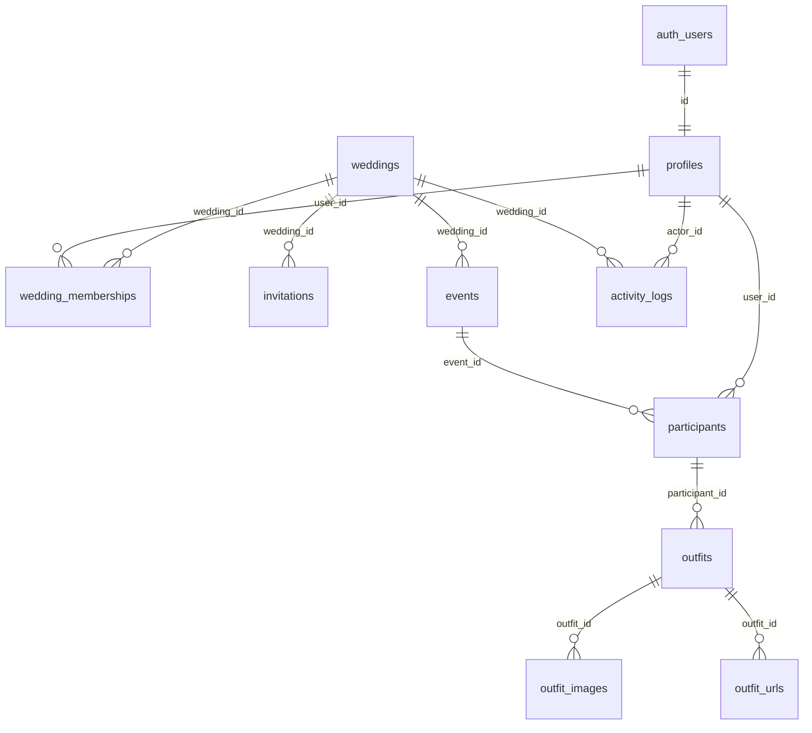

# Wedding Planner – Database Design

**Product:** Wedding Planner  
**Document type:** Physical database and Supabase architecture  
**Phase:** 3  
**Depends on:** [PRD.md](PRD.md) (LOCKED), [SDD.md](SDD.md) (LOCKED), [PHASE-2.1.md](PHASE-2.1.md)  
**SQL location:** [`/schema`](../schema/README.md)  
**Migrations:** [MIGRATIONS.md](MIGRATIONS.md)  
**Progress log:** [log.md](log.md) only  

This document is the physical design. Scripts live in `/schema`. Do not duplicate work history in `/schema`.

No React UI is specified here.

---

## 1. Database architecture

The system uses **Supabase-hosted PostgreSQL** as the source of truth. The React app (later) talks to PostgREST and Storage with a user session. GitHub Pages never stores wedding rows.

**Layers**

- **auth.users** — identity and credentials (Supabase Auth).
- **public.profiles** — product user (Lucky is seeded Super Admin). Linked 1:1 to `auth.users`.
- **public.\*** — wedding domain tables with Row Level Security.
- **storage.objects** — private outfit reference images in bucket `outfit-references`.
- **Derived views** — progress percentages (PRD Section 19). Never stored as editable columns.

**Design principles**

- Multi-wedding isolation via `wedding_id` on every wedding-scoped row.
- Dynamic users, events, participants, outfits (no fixed catalogs).
- Archive (`archived_at`) instead of day-to-day delete.
- Permanent delete is a real `DELETE`, Super Admin only, typically after archive.
- Audit stamps on every entity.
- Caps of five active images and five active URLs per outfit, enforced in the database.
- Progress is computed in views so client and server cannot drift.

**Apply order**

Apply **only** through the Phase 3.2 runner (`python scripts/migrate.py`). See [MIGRATIONS.md](MIGRATIONS.md). Do not create tables in the Supabase Dashboard.

Locked baseline files (do not edit after apply):

1. `schema/001_initial_schema.sql`
2. `schema/002_rls_policies.sql`
3. `schema/003_storage.sql`
4. `schema/004_seed_data.sql`

Forward files start at `schema/005_example.sql`.

---

## 2. Entity list

| Entity | Table | Scope |
| --- | --- | --- |
| User (profile) | `profiles` | Product |
| Wedding project | `weddings` | Product |
| Wedding membership | `wedding_memberships` | Wedding |
| Invitation | `invitations` | Wedding |
| Event | `events` | Wedding |
| Participant | `participants` | Event |
| Outfit | `outfits` | Participant |
| Reference image | `outfit_images` | Outfit |
| Shopping / reference URL | `outfit_urls` | Outfit |
| Activity | `activity_logs` | Wedding or product |

Auth users are not redesigned; they remain `auth.users`.

---

## 3. Table definitions

Column-level rules (types, nullability, checks) are in `001_initial_schema.sql`. Summary:

### 3.1 profiles

Product person. No `archived_at` (PRD: deactivate the account; archive **membership** to leave one wedding).

- `id` — same as `auth.users.id`
- `email`, `display_name`
- `is_super_admin` — Lucky seeded `true`
- `is_deactivated` — cannot use the product (BR-16)
- `relationship_note` — optional, not a security role
- Audit stamps

### 3.2 weddings

- `name`, `couple_names`, `wedding_date`, `notes`
- `archived_at`, `archived_by`
- Audit stamps

First row: Lucky & Kareena Wedding 2026 (seed).

### 3.3 wedding_memberships

- `wedding_id`, `user_id`
- `role` — `admin` \| `member` \| `viewer` (never Super Admin)
- `archived_at` — membership archive (remove from that wedding)
- Unique `(wedding_id, user_id)`

### 3.4 invitations

- `wedding_id`, `email`, `invited_role`
- `status` — pending, accepted, rejected, expired, cancelled
- `token_hash` — SHA-256 hex of the secret link (raw token never stored)
- `expires_at` — default 14 days from create/resend
- `accepted_by`, `accepted_at`
- Partial unique: one **pending** invite per `(wedding_id, email)` among non-archived rows

### 3.5 events

- `wedding_id`, `name`, `event_date`, `start_time`, `end_time`, `location`, `notes`
- `status` — draft, planned, confirmed, completed, cancelled
- Confirmed/Completed require `event_date` and at least one active participant (triggers)
- Unique active name per wedding (case-insensitive)

### 3.6 participants

- `event_id`, `wedding_id` (denormalized for RLS)
- `user_id` — nullable after permanent user delete (outfits remain)
- `role_in_event` — descriptive label only
- Unique `(event_id, user_id)` when `user_id` is not null

### 3.7 outfits

- `participant_id`, `event_id`, `wedding_id`, `owner_user_id` (denormalized)
- `dress_type`, `colour`, `quantity` (≥ 1), `notes`
- `status` — idea, shortlisted, ordered, received, altered, ready, dropped
- Beyond Idea (except Dropped): `dress_type` and `colour` required

### 3.8 outfit_images

- `outfit_id`, `wedding_id`, `storage_path`, `sort_order` (1–5)
- At most five rows per outfit with `archived_at IS NULL`

### 3.9 outfit_urls

- `outfit_id`, `wedding_id`, `url` (http/https), `label`, `sort_order` (1–5)
- At most five active rows per outfit

### 3.10 activity_logs

- `wedding_id` (null for product-level, e.g. user created)
- `actor_id`, `activity_type`, `entity_type`, `entity_id`, `payload`
- Immutable in normal use (insert only)
- Includes the PRD minimum vocabulary plus archive/restore/delete types

**Shared audit on every table except as noted**

- `created_at`, `created_by`
- `updated_at`, `updated_by`

`activity_logs` uses created stamps only (`updated_*` copies created on insert).

---

## 4. Relationships

Cardinality: one wedding, many members and events; one event, many participants; one participant, many outfits; one outfit, 0–5 active images and 0–5 active URLs.

---

## 5. Primary and foreign keys

| Table | PK | Foreign keys |
| --- | --- | --- |
| profiles | `id` | `id` → `auth.users(id)` ON DELETE CASCADE |
| weddings | `id` | `created_by` / `updated_by` / `archived_by` → `profiles(id)` ON DELETE SET NULL |
| wedding_memberships | `id` | `wedding_id` → weddings CASCADE; `user_id` → profiles CASCADE |
| invitations | `id` | `wedding_id` CASCADE; `accepted_by` → profiles SET NULL |
| events | `id` | `wedding_id` CASCADE |
| participants | `id` | `event_id` CASCADE; `wedding_id` CASCADE; `user_id` SET NULL |
| outfits | `id` | `participant_id` CASCADE; `event_id` CASCADE; `wedding_id` CASCADE; `owner_user_id` SET NULL |
| outfit_images | `id` | `outfit_id` CASCADE; `wedding_id` CASCADE |
| outfit_urls | `id` | `outfit_id` CASCADE; `wedding_id` CASCADE |
| activity_logs | `id` | `wedding_id` SET NULL; `actor_id` SET NULL |

Wedding CASCADE on permanent delete removes children (PRD 18). User CASCADE removes memberships, not events. Participant `user_id` SET NULL keeps outfit history.

---

## 6. Index strategy

- All foreign keys indexed.
- `(wedding_id)` and `(wedding_id, archived_at)` on wedding-scoped tables for isolation and active lists.
- `profiles(email)` unique (citext).
- `profiles(is_super_admin)` partial where true (last Super Admin checks).
- Unique `(wedding_id, user_id)` on memberships.
- Unique `invitations(token_hash)`.
- Partial unique pending invitations `(wedding_id, email)`.
- Unique active event names `(wedding_id, lower(name))`.
- `activity_logs(wedding_id, created_at DESC)`.
- `activity_logs(entity_type, entity_id)`.
- `outfits(owner_user_id)` for Member own-outfit writes.
- `participants(event_id, user_id)`.
- `outfit_images(outfit_id)` where `archived_at IS NULL`.

---

## 7. Row Level Security design

RLS is enabled on every public table. `anon` has no table rights. `authenticated` has rights that RLS then filters. `service_role` bypasses RLS (migrations, emergency).

**Helpers** (stable, `search_path` pinned):

- `is_super_admin()`
- `is_current_user_active()` — not deactivated
- `wedding_role(wedding_id)` — active membership role or null
- `is_wedding_admin(wedding_id)`
- `has_wedding_access(wedding_id)` — active membership or Super Admin
- `can_see_archived_wedding(wedding_id)` — Super Admin only

**Read (SELECT)**

| Role | Weddings | Planning rows |
| --- | --- | --- |
| Super Admin | All, including archived | All |
| Admin | Assigned, non-archived (archived wedding: Super Admin only) | All rows in that wedding, including archived (restore) |
| Member / Viewer | Assigned non-archived weddings | Non-archived rows in that wedding |

Write isolation remains stricter than read (below). Wedding-level **read** for Member/Viewer enforces cross-wedding isolation (DEC-007). The app may still show Members only their events.

**Write**

- **profiles:** self update of display fields; Super Admin update of flags; cannot clear last Super Admin (trigger).
- **weddings:** INSERT Super Admin; UPDATE Super Admin or Admin (assigned, not archived); DELETE Super Admin and row already archived.
- **memberships:** INSERT/UPDATE Super Admin or wedding Admin; DELETE Super Admin after archive.
- **invitations:** INSERT/UPDATE Super Admin or wedding Admin; recipient may UPDATE own pending row to accepted/rejected via RPC (email match).
- **events / participants:** INSERT/UPDATE Super Admin or wedding Admin; Member/Viewer no write; DELETE Super Admin after archive.
- **outfits / images / urls:** Super Admin or Admin; Member INSERT/UPDATE/ARCHIVE **own** `owner_user_id = auth.uid()` on non-archived wedding; Viewer none; DELETE Super Admin after archive.
- **activity_logs:** INSERT via triggers/RPCs (security definer); SELECT per visibility; no UPDATE; DELETE Super Admin only.

Deactivated users fail `is_current_user_active()` and see no domain rows.

---

## 8. Storage bucket design

| Bucket | Public | Purpose |
| --- | --- | --- |
| `outfit-references` | No | Outfit reference images only |

**Object key:** `{wedding_id}/{outfit_id}/{image_id}_{filename}`

Policies: read if the caller can SELECT the matching `outfit_images` row (via wedding access). Upload/update/delete if the caller can INSERT/UPDATE that outfit (Admin/Super Admin/owner Member). Max five **active** images is enforced on `outfit_images`, not by Storage file count.

Detaching an active image: delete or archive the `outfit_images` row and remove the object (SDD 9.4). Archiving an outfit does **not** remove objects.

---

## 9. Audit field strategy

Every entity has `created_at`, `created_by`, `updated_at`, `updated_by`. Archive rows also have `archived_at`, `archived_by`.

- Triggers fill `updated_at` / `updated_by` from `auth.uid()` when present.
- Seed uses Lucky’s profile id as actor (system seed documented).
- `activity_logs` records at least: user_created, event_created, event_edited, outfit_updated, status_changed, image_added, image_removed, invitation_accepted, plus invitation_sent, archived, restored, permanently_deleted.
- Stamps survive archive. Permanent delete removes the row; a `permanently_deleted` activity may remain with `entity_id` only.

---

## 10. Archive strategy

| Operation | Mechanism |
| --- | --- |
| Archive | Set `archived_at` / `archived_by`. RPCs cascade to children (PRD 18). |
| Restore | Clear archive timestamps on parent and children archived in the same cascade (children later permanently deleted stay gone). |
| Permanent delete | `DELETE` after archive, Super Admin. Wedding delete cascades by FK. |
| User deactivation | `profiles.is_deactivated = true`, not archive. |
| Event Cancelled / outfit Dropped | Status columns, not archive. |

Active image/URL caps count rows with `archived_at IS NULL`. Progress views omit archived rows, cancelled events, and dropped outfits.

---

## 11. Seed data strategy

`004_seed_data.sql`:

1. Create Auth user **Lucky** with a known UUID, confirmed email, and a **temporary password that must be rotated**.
2. Upsert `profiles` with `is_super_admin = true`.
3. Insert wedding **Lucky & Kareena Wedding 2026**.
4. Insert Lucky’s **admin** membership on that wedding (Super Admin already sees all weddings; membership lets him appear as a participant later).
5. Write `activity_logs` for user created.

No sample events, outfits, or invitations. Users stay fully dynamic after Lucky.

If Auth insert is rejected on a given Supabase version, create Lucky in the Auth dashboard with the same UUID and re-run the profile/wedding statements (documented in `/schema/README.md`).

---

## 12. Migration strategy

- Numbered files are the migration sequence. Apply once, in order, on a fresh project (SQL Editor or Supabase CLI `db push` / migration folder copy).
- Never edit a file that has been applied in production; add `005_*.sql` later.
- RLS ships in `002` so `001` can be loaded as table owner.
- Storage is separate because `storage` schema exists only on Supabase.
- Seed is last and is **idempotent** on the Lucky UUID and first wedding UUID.
- Rollback: restore a database backup; reverse archive is not a substitute for backup.
- Progress math changes require a new migration that replaces views, not client-only constants.

---

## Progress views (derived)

Weights: Idea 0, Shortlisted 20, Ordered 40, Received 60, Altered 80, Ready 100, Dropped excluded.

- `v_outfit_progress` — weight per active non-dropped outfit  
- `v_participant_progress` — average of those outfits, else 0  
- `v_event_progress` — average of active participants, else 0; cancelled flagged excluded from wedding  
- `v_wedding_progress` — average of non-cancelled, non-archived events (Completed included)

---

## RPCs (database API)

Defined in `002_rls_policies.sql`. Client contracts: [API.md](API.md).

- `accept_invitation(p_token text)`
- `reject_invitation(p_token text)`
- `resend_invitation(p_invitation_id uuid)`
- `cancel_invitation(p_invitation_id uuid)`
- `archive_wedding` / `restore_wedding`
- `archive_event` / `restore_event`
- `archive_participant` / `restore_participant`
- `archive_outfit` / `restore_outfit`
- `permanently_delete_wedding(p_wedding_id uuid)`
- `permanently_delete_event` / `participant` / `outfit` (Super Admin, archived only)

---

## Phase completion

- [x] Database architecture
- [x] Entity list
- [x] Table definitions
- [x] Relationships
- [x] Primary and foreign keys
- [x] Index strategy
- [x] Row Level Security design
- [x] Storage bucket design
- [x] Audit field strategy
- [x] Archive strategy
- [x] Seed data strategy
- [x] Migration strategy
- [x] SQL in `/schema` in numbered order
- [x] No React UI

Phase 3.2: schema changes are applied by the automated runner. Domain design in this file remains LOCKED.

**Phase 3 Status: DATABASE READY FOR IMPLEMENTATION**
