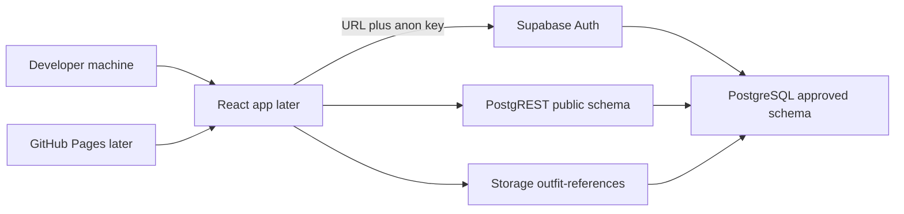

# Wedding Planner – Supabase Infrastructure

**Document type:** Live project connection guide  
**Phase:** 3.1  
**Depends on:** [DATABASE.md](DATABASE.md), [API.md](API.md), [`/schema`](../schema/README.md)  
**Constraint:** Do not redesign the database. Do not write React UI or business logic.

This document connects a **live Supabase project** to the **already-approved** schema (`001`–`004`). Schema updates after 3.2 use [MIGRATIONS.md](MIGRATIONS.md). Progress is recorded only in [log.md](log.md).

---

## 1. Supabase project creation

Create one Supabase project per environment you intend to use (recommended: **production** now; optional later: a second project for staging). Do not share one database between unrelated experiments.

### 1.1 Dashboard steps

1. Sign in at [https://supabase.com](https://supabase.com) with the organization that will own Lucky and Kareena Wedding 2026 data.
2. **New project**.
3. **Name:** `wedding-planner` (or `wedding-planner-prod`). This is the cloud project name, not the wedding display name.
4. **Database password:** generate a strong password and store it in a password manager. This is the Postgres role password, **not** Lucky’s app password. You will not put it in the frontend `.env`.
5. **Region:** choose the region closest to the family (for example South Asia or the nearest available). Do not change region later; it is effectively fixed.
6. Wait until the project status is **Active** (API URL and keys are shown).

### 1.2 Project identifiers to copy

From **Project Settings → API**:

- **Project URL** — `https://<project-ref>.supabase.co`
- **anon public** key — safe for the later React app
- **service_role** key — server/dashboard only; never in git, never in the browser

From **Project Settings → General**:

- **Reference ID** — used by the CLI if you adopt it later

### 1.3 Apply the approved schema (do not rewrite it)

Do **not** create tables in the Dashboard. Apply git SQL with one command (Phase 3.2):

```text
python scripts/migrate.py
```

Requires `psql` and `SUPABASE_DB_URL` (or `DATABASE_URL`) in the environment or an untracked `.env`. The runner applies pending files in `/schema` in order (`001`–`004` then `005_example.sql` and later), records history, and never re-runs successful versions. Details: [MIGRATIONS.md](MIGRATIONS.md).

Break-glass: SQL Editor as database owner if the runner cannot connect. Then the database must still match `/schema`. If `004` fails on `auth.users` for this Supabase version, follow [schema/README.md](../schema/README.md); do not redesign tables.

Do not add extra tables, buckets, or RLS in the dashboard that conflict with these scripts.

---

## 2. Authentication configuration

Auth is **Supabase Auth**. App users are `auth.users`; product users are `public.profiles` (created by `handle_new_user` in `002`). Super Admin seeding is **Lucky** from `004`.

### 2.1 Providers

In **Authentication → Providers**:

- **Email** — enabled.
- **Confirm email** — enabled for new family sign-ups (Lucky’s seed user is already confirmed in `004`).
- **Phone / social providers** — leave disabled unless a later phase adds them. Invitations are email or secure link (PRD Section 17), not OAuth.

Open self-service registration must stay **on** enough that an invited person can create an account with the **same email** as the invitation, then call `accept_invitation`. Do not require a custom SMTP provider in this phase; the default Auth email sender is enough to start. For production family use, configure a custom SMTP later so invites are not rate-limited.

### 2.2 URL configuration

In **Authentication → URL Configuration** (update when GitHub Pages URL is known):

- **Site URL** — the production app origin (for example `https://<org>.github.io/Wedding_Planner/`). Until the app exists, a local origin such as `http://localhost:5173` is acceptable.
- **Redirect URLs** — include:
  - `http://localhost:5173/**`
  - `http://127.0.0.1:5173/**`
  - the GitHub Pages origin and `/**` when deployed

### 2.3 Session and password

- Session lifetime: keep Supabase defaults unless a later security review says otherwise.
- **Lucky seed login** (rotate on first successful sign-in):
  - Email: `lucky@weddingplanner.app`
  - Temporary password: `ChangeMe-Lucky-Seed-2026`
- After rotation, optionally map Lucky’s email to a real mailbox in **Authentication → Users** so password recovery works. Do **not** change Lucky’s user UUID.

### 2.4 Deactivation

`profiles.is_deactivated` is enforced in RLS (`is_current_user_active`). There is no extra Auth hook required in this phase. Do not delete Lucky’s Auth user.

---

## 3. Storage bucket configuration

Storage is defined in `schema/003_storage.sql`. Prefer **running that script** over clicking “New bucket” with a different name.

| Setting | Required value |
| --- | --- |
| Bucket id / name | `outfit-references` |
| Public | **No** (private) |
| File size limit | 10 MiB (`10485760`) |
| MIME types | `image/jpeg`, `image/png`, `image/webp`, `image/heic`, `image/heif` |
| Object key | `{wedding_id}/{outfit_id}/{filename}` |

### 3.1 Dashboard verification

**Storage → Buckets:** `outfit-references` exists, not public.

**Storage → Policies:** four policies from `003` (`outfit_references_select` / `_insert` / `_update` / `_delete`). Do not add a “public read” policy.

### 3.2 Relationship to the database

A sixth **active** image is rejected by the `outfit_images` trigger, not by Storage file count. Archiving an outfit does not delete objects; detaching an image on an active outfit does (SDD / DATABASE). GitHub Pages never hosts family photos.

---

## 4. Environment variables (`.env` structure)

The later React app (Vite assumed, matching a static GitHub Pages build) reads **only** the public API URL and the **anon** key. Do not create a committed file that contains real keys.

### 4.1 File names

| File | Git | Purpose |
| --- | --- | --- |
| `.env.example` | yes (placeholders only) | Documents names |
| `.env` or `.env.local` | no | Real values on a developer machine |
| GitHub Pages / CI secrets | no in repo | Injected at **build** time |

### 4.2 Required public variables

```
# Public Supabase API (browser-safe)
VITE_SUPABASE_URL=https://YOUR_PROJECT_REF.supabase.co
VITE_SUPABASE_ANON_KEY=YOUR_ANON_PUBLIC_KEY
```

### 4.3 Variables that must never ship in the frontend

```
# Local/CI only — SQL, migrations, emergency admin
# Do not prefix with VITE_
SUPABASE_SERVICE_ROLE_KEY=
SUPABASE_DB_PASSWORD=
```

### 4.4 Rules

- Anything prefixed `VITE_` is embedded in the static bundle. That is why only URL + anon key use `VITE_`.
- The anon key is not a secret in the same way as `service_role`; **RLS is the control**. Never “temporarily” put `service_role` in `VITE_*` to debug.
- No `.env` in `/schema`. No secrets in [log.md](log.md).

---

## 5. Project architecture

The schema is unchanged. This phase only names **which live services** the locked design uses.



| Piece | Lives where | Trust |
| --- | --- | --- |
| Static app | GitHub Pages (later) | Untrusted for data |
| Session | Supabase Auth | Issues JWT |
| Rows, views, RPCs | `public` schema from `/schema` | Authoritative; RLS |
| Images | Bucket `outfit-references` | Private; storage policies |
| Migrations | Run by dashboard SQL Editor or CI with **service_role** | Owner |

Cross-wedding isolation remains RLS + `wedding_id`. Lucky remains product-level Super Admin. Additional users still join through invitations (RPC), not by editing Auth in the dashboard except for break-glass recovery.

---

## 6. Connection verification checklist

Complete these against the **live** project after `001`–`004`. No React required: use SQL Editor, Auth Users, Storage, and optionally a REST probe with the anon key.

- [ ] Project status is Active; URL and anon key copied to a local untracked env file matching Section 4.
- [ ] `001`–`004` applied in order with no manual table redesign.
- [ ] Tables exist: `profiles`, `weddings`, `wedding_memberships`, `invitations`, `events`, `participants`, `outfits`, `outfit_images`, `outfit_urls`, `activity_logs`.
- [ ] Views exist: `v_outfit_progress`, `v_participant_progress`, `v_event_progress`, `v_wedding_progress`.
- [ ] RLS is **enabled** on those tables (Table Editor or `pg_class.relrowsecurity`).
- [ ] Auth user Lucky exists with UUID `11111111-1111-4111-8111-111111111111`.
- [ ] `profiles` row for Lucky has `is_super_admin = true` and `is_deactivated = false`.
- [ ] Wedding `22222222-2222-4222-8222-222222222222` named **Lucky & Kareena Wedding 2026**.
- [ ] Lucky has an **admin** membership on that wedding.
- [ ] Lucky can sign in with email/password, then password is rotated.
- [ ] RPCs exist: `create_invitation`, `accept_invitation`, `reject_invitation`, `resend_invitation`, `cancel_invitation`, `archive_*`, `permanently_delete_*`.
- [ ] Bucket `outfit-references` is private; object path convention documented.
- [ ] Unauthenticated REST `GET /rest/v1/weddings` with **no** key or a bogus key does not list family rows.
- [ ] Anon key **without** a user JWT cannot select `weddings` (RLS + `authenticated` role).
- [ ] `service_role` was used only in SQL Editor / server, never in a page script.

---

## 7. Security checklist

- [ ] `service_role` and database password are not in git, screenshots, or chat logs.
- [ ] Frontend env contains only `VITE_SUPABASE_URL` and `VITE_SUPABASE_ANON_KEY`.
- [ ] Email confirmations enabled for new users; Lucky seed password rotated.
- [ ] Last Super Admin cannot be deactivated (trigger already in `001`); do not delete Lucky to “test”.
- [ ] Storage bucket is private; no public-read policy.
- [ ] Site URL and redirect allowlist will be restricted to localhost and the real GitHub Pages origin (no `*` production redirect).
- [ ] Postgres dashboard access limited to the family operator (Lucky / designated Super Admin).
- [ ] Point-in-time recovery / daily backups: enable on the paid plan when the project holds real photos; until then export is an operator responsibility.
- [ ] Invitation tokens: only hashes stored (`token_hash`); raw tokens live in email/link, not in tables.
- [ ] GitHub Pages remains untrusted; never put service keys in GitHub Pages env as `VITE_*`.

---

## 8. Deployment prerequisites

These must be true **before** a React foundation is deployed to GitHub Pages. This phase does not implement the app.

1. **Live Supabase project** with `/schema` applied via `python scripts/migrate.py` and Section 6 checklist passed.
2. **Auth URL config** updated to the GitHub Pages origin when it exists; localhost kept for development.
3. **Build-time env** for CI: `VITE_SUPABASE_URL` and `VITE_SUPABASE_ANON_KEY` for the static app; `SUPABASE_DB_URL` only on the migrate job (not `VITE_`).
4. **SPA hosting:** GitHub Pages must serve `index.html` for client routes (implementation later). HTTPS is required for Auth cookies/redirects and for a later PWA.
5. **No schema drift:** production must not receive ad-hoc Table Editor columns. New SQL is the next numbered `/schema` file; never edit applied `001`–`004`.
6. **Operator access:** Lucky (or a second Super Admin) can sign in after password rotation.
7. **Storage:** `outfit-references` ready; no plan to store images in the git repo.
8. **Secrets rotation plan:** if the anon key or service role is leaked, rotate in Project Settings → API and update local env / CI.

Out of scope until the React foundation: Vite app, routing, PWA, notification vendors.

---

## Related documents

- Migrations: [MIGRATIONS.md](MIGRATIONS.md)
- Physical design: [DATABASE.md](DATABASE.md)
- RPC/table contracts: [API.md](API.md)

---

**Infrastructure Ready for React Foundation**
