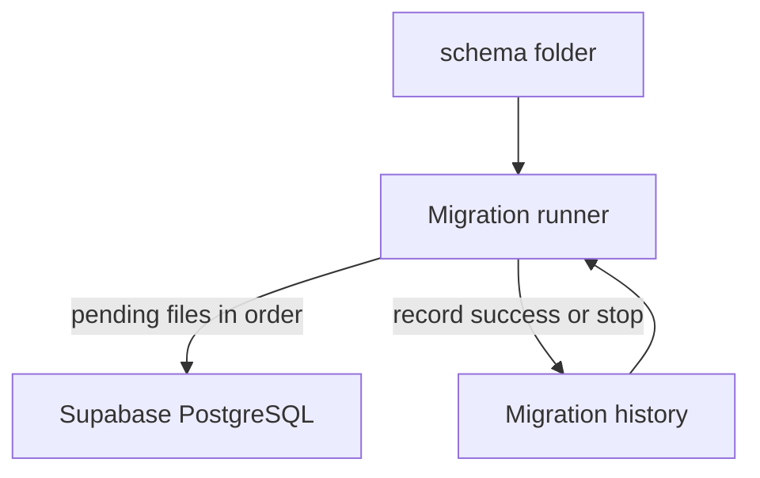
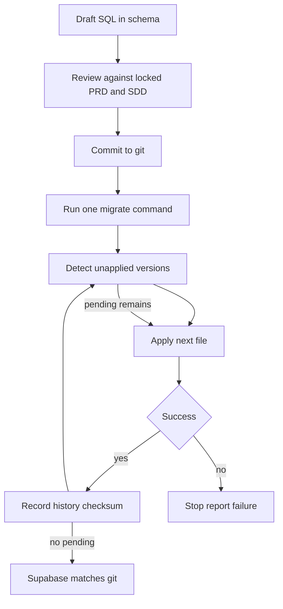

# Wedding Planner – Automated Database Migrations

**Document type:** Migration architecture and runner specification  
**Phase:** 3.2  
**Depends on:** [DATABASE.md](DATABASE.md) (LOCKED design), [INFRASTRUCTURE.md](INFRASTRUCTURE.md)  
**SQL source of truth:** [`/schema`](../schema/README.md) files `001`–`004` (immutable) plus later numbered files  
**Runner:** [`/scripts/migrate.py`](../scripts/migrate.py)  
**Progress log:** [log.md](log.md) only  

Locked phases (1, 2, 2.1, 3, 3.1) are not redesigned here. Domain tables and business rules stay in `001`–`004` exactly as written.

---

## 1. Migration architecture

### 1.1 Why migrations are required

The Wedding Planner database is a living contract: RLS, invitation RPCs, archive cascades, progress views, and Lucky’s seed. If each developer (or the dashboard) creates tables by hand, those contracts diverge. A later GitHub Pages app would talk to a database that no longer matches [API.md](API.md).

Versioned SQL files in `/schema` are the only place domain DDL may appear. The runner applies what is in git, in order, once.

### 1.2 Why manual Supabase table creation is forbidden

The Table Editor does not produce a reviewable file, a checksum, or a history row. It cannot guarantee max-five image triggers, last-Super-Admin protection, or wedding isolation. After Phase 3.2, **do not create or alter tables in the Dashboard**. Change means: new `/schema/NNN_description.sql` → one migrate command.

Break-glass SQL Editor use is recovery only (Section 6), then the recovered state must still match git.

### 1.3 Versioned migration strategy

- One file, one version: `NNN_short_snake_name.sql`
- Versions are three-digit, zero-padded, increasing by one
- `001`–`004` are the locked baseline; never edit them after they have been applied anywhere
- New work starts at `005` and onward (`005_example.sql` is the first non-baseline file)

### 1.4 Idempotent philosophy

- **File-level idempotency:** a successfully applied version is never executed again.
- **Statement-level idempotency:** new SQL should still use `IF NOT EXISTS` / `DROP POLICY IF EXISTS` where safe so a restored database can be repaired, but **the runner does not re-run completed files** even if they are idempotent.
- **Checksum:** if a completed file’s bytes change, the runner **fails**. Fix with a new version, not by editing history.

---

## 2. Migration lifecycle

1. Author writes a new file in `/schema` (never edit `001`–`004`).
2. Review: no business-rule change unless a later product phase says so.
3. Commit the SQL. Documentation updates go in `/docs`. Progress only in [log.md](log.md).
4. Run `python scripts/migrate.py`.
5. Runner compares `/schema` to history, applies pending files in order, stops on the first error.
6. Each success is recorded; completed files are never re-run.

---

## 3. Migration naming convention

| File | Role |
| --- | --- |
| `001_initial_schema.sql` | Locked baseline: types, tables, indexes, views |
| `002_rls_policies.sql` | Locked baseline: RLS and RPCs |
| `003_storage.sql` | Locked baseline: `outfit-references` |
| `004_seed_data.sql` | Locked baseline: Lucky + first wedding |
| `005_example.sql` | First forward file (example; no domain change) |
| `005_add_notifications.sql` | Hypothetical later file (do not invent modules now) |
| `006_add_budget_module.sql` | Hypothetical later file |

**Pattern:** `NNN_lowercase_words.sql`

- `NNN` is exactly three digits: `001`, `002`, … `010`, not `10` or `1`
- The number **is the version**. It is **immutable**. Never rename `003_storage.sql` to `003_buckets.sql` after apply; never reuse `003` for a different file
- The suffix is descriptive English snake_case
- Gaps are forbidden: after `005` the next file must be `006`, not `007`
- Do not skip numbers to “leave room”

---

## 4. Migration runner specification

Implementation lives in `/scripts/migrate.py`. This section is the contract, not a copy of the source.

**Reads `/schema`**

- Discovers `NNN_*.sql` only
- Ignores other files (including `README.md`)

**Detects pending migrations**

- Loads history of **successful** versions
- Pending = files whose version is not successfully recorded
- Compares checksum of every **successful** file to disk; mismatch is a hard failure

**Executes in order**

- Sorts by integer version
- Applies the next pending file only if it is exactly `max(successful) + 1`, or `001` when history is empty
- Never skips numbers: missing `003` while `004` exists on disk is a hard failure

**Stops on failure**

- Does not continue to the next file
- Records an unsuccessful attempt for that version (not a success)
- Later runs refuse to proceed until an operator recovers (Section 6)

**Never re-runs completed migrations**

- `success = true` rows are skipped forever

**Execution report** (stdout)

- Listed applied versions
- Listed pending versions
- Each file: started, success or error
- Final: applied count, failed version if any, exit code `0` or `1`

**Connection**

- Uses a Postgres URI from the environment (`SUPABASE_DB_URL` or `DATABASE_URL`)
- Never reads `VITE_*` keys for DDL
- Never prints the password

**History metadata**

- The runner ensures a history store exists before applying `/schema` files. That store is **runner metadata**, not a Wedding Planner domain table, and must not be created in the Dashboard.

---

## 5. Migration history

Conceptual record (one row per attempt/version). No table DDL in this document.

| Concept | Meaning |
| --- | --- |
| Migration version | The `NNN` prefix (`001`, `005`, …) |
| File name | Exact basename, e.g. `002_rls_policies.sql` |
| Applied timestamp | When the runner finished that attempt |
| Success status | True only if the entire file completed |
| Checksum | SHA-256 of the file bytes at apply time |

Successful rows are the lock that prevents re-execution. A changed checksum on a successful version means someone edited an applied file; the runner must refuse.

---

## 6. Rollback strategy

**Forward-only**

- Do not edit or delete `001`–`004`
- Do not “roll back” by re-running an old file
- To undo a change, add a **new** version that forwards the schema to the desired state (or restore a backup, then apply git)

**Emergency rollback**

- Restore the Supabase project from a backup / point-in-time recovery to a time before the bad file
- Do not hand-edit production tables to “match” a failed file

**Recovery after failure**

1. Read the runner report and Postgres error
2. Restore backup if the failed file left partial objects
3. Leave the failed file unchanged if it was already shared; add `NNN+1` with the fix **or** restore and retry only if the failed version was **never** marked success and the database is clean
4. Re-run `python scripts/migrate.py`
5. Record the incident in [log.md](log.md) only

**Failed migration handling**

- Stop the pipeline
- Do not apply later numbers
- Do not skip the failed number
- Frontend deploys must not proceed on a failed migrate job

---

## 7. Development workflow

Always: new file in `/schema` → review → commit → `python scripts/migrate.py` against the target project → confirm history → log in [log.md](log.md).

### Scenario A — Adding a new table

1. Do **not** open Table Editor.
2. Add `NNN_add_<table>.sql` with `CREATE TABLE`, indexes, audit columns, RLS enablement as required by the locked PRD.
3. Migrate. Verify via information_schema or Table Editor **read-only**.
4. Update [DATABASE.md](DATABASE.md) and [API.md](API.md) in a later docs commit if the domain model changed (product phase required).

### Scenario B — Adding a new column

1. Add `NNN_add_<table>_<column>.sql` with `ALTER TABLE ... ADD COLUMN`.
2. Do not change `001_initial_schema.sql`.
3. Migrate. Client code (Phase 4+) may read the column only after this version is applied in that environment.

### Scenario C — Adding RLS

1. Add `NNN_rls_<table>_<policy>.sql` with `DROP POLICY IF EXISTS` / `CREATE POLICY`.
2. Do not edit `002_rls_policies.sql` after it is applied.
3. Migrate. Test as anon vs authenticated vs Lucky.

### Scenario D — Adding Storage

1. Add `NNN_storage_<bucket>.sql` following `003` patterns (private bucket, path convention, policies).
2. Do not recreate `outfit-references` in the Dashboard.
3. Migrate. Confirm bucket list and policies.

---

## 8. CI/CD integration

No GitHub Actions YAML in this phase. When CI exists:

- **Secrets:** `SUPABASE_DB_URL` (or equivalent) in GitHub Actions secrets. Never `VITE_` for this job. Never log secrets.
- **Order:** checkout → run `python scripts/migrate.py` against production or staging URI → only then build/deploy the React app.
- **Safety:** run migrations once per environment; fail the job on non-zero exit; do not use `--force` flags; production URI only on the `main` (or release) branch.
- **Production:** apply pending versions, then deploy static files. If migrate fails, do not deploy.

---

## 9. Security rules

- Never expose `service_role` to the browser, GitHub Pages, or `VITE_*` variables.
- Only the migration runner (and break-glass SQL Editor as the project owner) uses elevated Postgres privileges.
- The frontend always uses the **anon** key plus a user JWT.
- Migration **files** never contain database passwords, Lucky’s rotated password, or API keys. Seed file `004` contains only the documented temporary Lucky app password, which must be rotated in Auth after first login ([INFRASTRUCTURE.md](INFRASTRUCTURE.md)).
- `.env` / `.env.local` stay untracked.

---

## 10. Documentation map

| File | Role after 3.2 |
| --- | --- |
| This file | Migration architecture and runner contract |
| [DATABASE.md](DATABASE.md) | Physical design; apply via runner |
| [INFRASTRUCTURE.md](INFRASTRUCTURE.md) | Live project; migrate command is the apply path |
| [CHANGELOG.md](CHANGELOG.md) | Version `docs-3.2` |
| [DECISIONS.md](DECISIONS.md) | DEC-009 |
| [log.md](log.md) | Only progress log |

---

## 11. Acceptance criteria

- [x] Automatic schema creation: empty project + runner + `001`–`004` creates the locked database
- [x] Automatic schema updates: new `/schema/NNN_*.sql` applied on the next migrate
- [x] Ordered migrations: numeric order, no skipped versions
- [x] Version tracking: history with version, file name, timestamp, success, checksum
- [x] Failure protection: stop on error; do not re-run successes; checksum drift fails
- [x] Manual Dashboard table creation forbidden in process docs
- [x] `001`–`004` unmodified
- [x] No React UI
- [x] Documentation complete (`MIGRATIONS.md` + listed updates)
- [x] Example forward file `005_example.sql` present
- [x] Runner at `/scripts/migrate.py`

---

**Phase 3.2 Status**

**AUTOMATED DATABASE MIGRATION READY**

**READY FOR PHASE 4 — REACT FOUNDATION**
