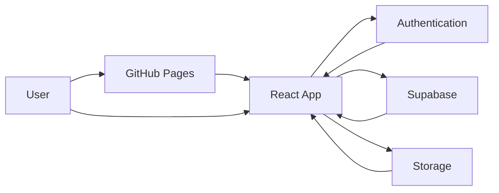
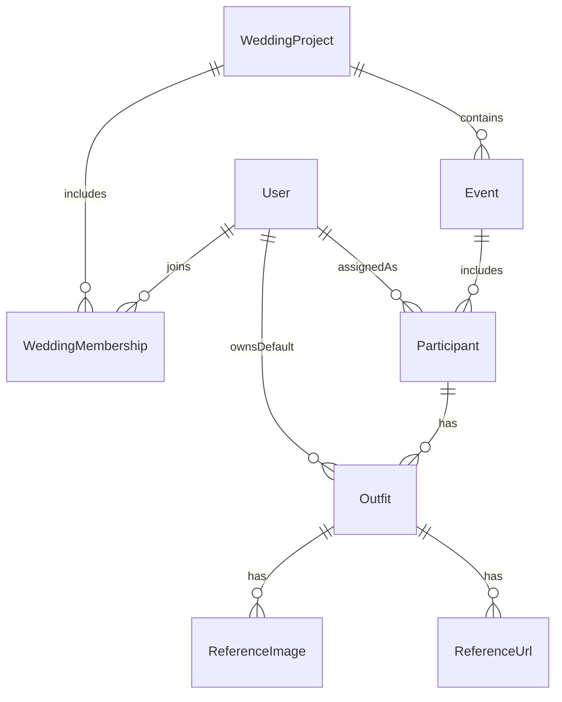
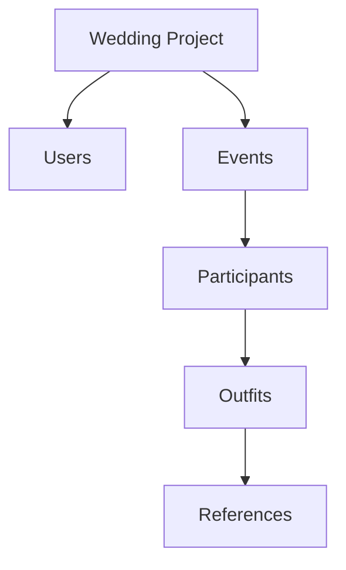
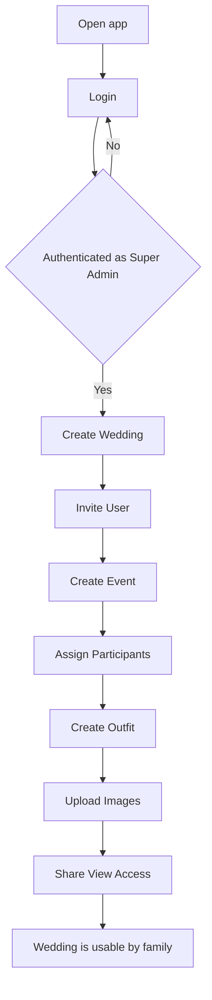
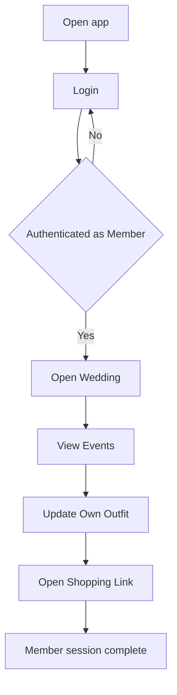
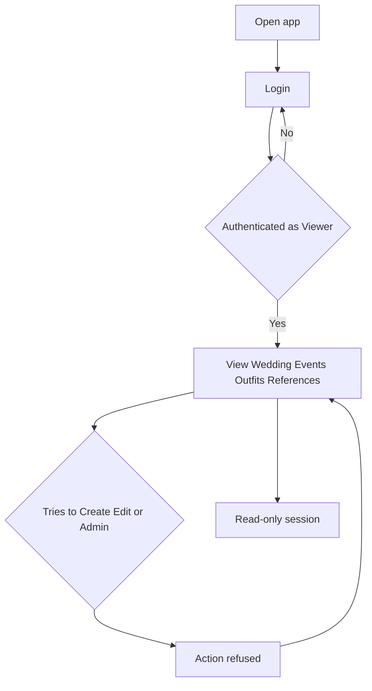
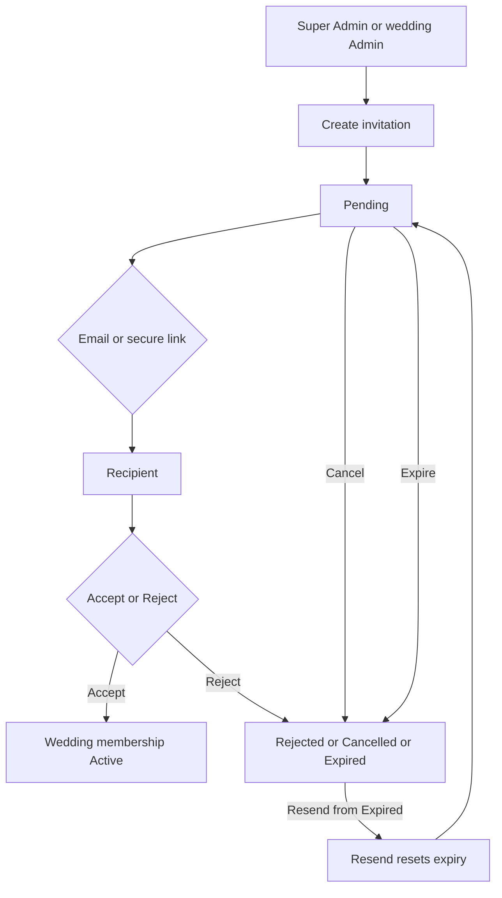

# Wedding Planner – Phase 2 System Design Document

**Product:** Wedding Planner  
**Document type:** System Design Document (SDD)  
**Phase:** 2 – Documentation only  
**Audience:** Architecture, engineering, and product  
**Initial wedding:** Lucky and Kareena Wedding 2026  
**Seeded Super Admin:** Lucky  
**Depends on:** [PRD.md](PRD.md)

This phase is documentation only. It does not contain React code, SQL, Supabase table definitions, or detailed UI screen designs.

---

## 1. System Overview

Wedding Planner is a **mobile-first multi-user web application**. Families use it to plan one or many weddings. The first production instance is **Lucky and Kareena Wedding 2026**. The same system must support **unlimited future weddings** and **unlimited users** without a redesign.

The system is a **static single-page application** talking to a **managed backend platform**. The browser never holds the source of truth. Wedding data, identity, and private images live behind authenticated services. GitHub Pages only serves the application shell.

### 1.1 Frontend

The frontend is a **React** web application optimized for phones, then tablets and desktop. It is responsible for:

- Sign-in and session presentation
- Navigation across weddings, events, participants, and outfits
- Enforcing the **visible** permission model (hiding actions the user cannot use)
- Optimistic local UI state while waiting for the backend
- Later: Progressive Web App installability (manifest, service worker, home-screen icon)

The frontend does **not** become the security boundary. Every read and write is authorized again by the backend.

### 1.2 Backend

The backend is **Supabase**: authentication, data access rules, file storage, and (later) optional server functions. Product modules talk to this backend through a thin **service layer** in the React app. There is no separate custom application server in Phase 2’s target architecture.

The backend is responsible for:

- Authenticating users
- Authorizing every query and mutation by role and wedding membership
- Persisting weddings, users, events, participants, outfits, and references
- Storing private reference images
- Isolating Wedding A from Wedding B

### 1.3 Database

The database is a **relational store** hosted by Supabase (PostgreSQL conceptually). Phase 2 defines **entities and relationships only**. Physical tables, columns, and SQL belong to Phase 3 ([DATABASE.md](DATABASE.md), not yet designed).

Conceptually the database holds:

- Product-level users and Super Admin flags
- Wedding projects
- Membership of users in weddings (with a role)
- Events under a wedding
- Participants under an event
- Outfits under a participant
- Up to five images and five URLs per outfit

### 1.4 Image storage

Reference images are **private objects** in **Supabase Storage**, not files inside the GitHub Pages deploy. Shopping links are **external URLs**, not stored files. Image access follows outfit permissions. Caps: **maximum five images per outfit**.

### 1.5 Authentication

**Supabase Auth** issues sessions. **Lucky** is the seeded Super Admin so the product is usable on first launch. Additional wedding-scoped users join through the **invitation and onboarding** flow (PRD Section 17): pending invite, accept or reject, expiry, resend, cancel. A deactivated user cannot obtain a valid session. The last remaining Super Admin cannot be demoted.

### 1.6 Hosting

The React build is hosted on **GitHub Pages** over HTTPS. Pages is a static host: it does not run a database or private file store. Environment-specific public keys for Supabase may be baked into the build; secrets that must stay private never ship in the frontend.

### 1.7 PWA future support

The architecture is **PWA-ready**, not PWA-complete in this phase:

- Mobile-first navigation and layout constraints from the PRD
- A later installable shell (web app manifest, service worker, offline read of recently viewed data)
- GitHub Pages remains a valid host because it serves static assets over HTTPS

PWA work must not require a new backend or a new information architecture.

---

## 2. High-Level Architecture

### 2.1 Runtime participants

| Participant | Role |
| --- | --- |
| User | Family member on a phone or other browser |
| React App | UI and client-side orchestration, hosted on GitHub Pages |
| Authentication | Supabase Auth session and identity |
| Supabase | Authorized data access for all wedding records |
| Storage | Private image objects for outfit references |
| GitHub Pages | Static hosting of the React application |

### 2.2 Data flow (words)

1. The user opens the app URL on GitHub Pages. The browser downloads the React shell.
2. If there is no session, the React app sends the user through Authentication.
3. Authentication returns a session to the React app.
4. The React app requests wedding data from Supabase using that session.
5. Supabase allows or denies each request using membership, role, and capabilities.
6. Allowed rows (weddings, events, participants, outfits, URL references) return to the React app.
7. When the user adds a reference image, the React app uploads to Storage under the authenticated user. Storage and data records stay aligned: an image without an outfit reference is orphaned and must be cleaned up by lifecycle rules.
8. Shopping links are stored as URL text in Supabase. Opening a link leaves the app and opens the external site.
9. GitHub Pages never sees wedding data; it only served the program that talks to Supabase.

### 2.3 Architecture diagram



### 2.4 Trust and isolation

- GitHub Pages is **untrusted** for family data.
- The React app is **honest but not authoritative**.
- Supabase and Storage are **authoritative**.
- Cross-wedding reads are forbidden except for Super Admins acting across weddings.

---

## 3. Information Architecture

The domain hierarchy is strict. Every child belongs to exactly one parent on this chain, except **Users**, who exist at product level and are **linked** into weddings and events.

```text
Wedding Project
  → Users (membership + role on this wedding)
  → Events
      → Participants
          → Outfits
              → References (images and shopping URLs)
```

### 3.1 Hierarchy rules

- A **Wedding Project** is the isolation boundary (Lucky and Kareena Wedding 2026 is the first).
- **Users** are global people. They join a wedding through membership. Unlimited users and unlimited weddings are first-class.
- An **Event** belongs to one wedding. Events are dynamic (not a fixed catalog).
- A **Participant** is a user assigned to one event. An event has many participants. A user may participate in many events.
- An **Outfit** belongs to one participant (hence one event and one wedding). A participant may have many outfits.
- **References** belong to one outfit: zero to five images and zero to five URLs.

### 3.2 Conceptual relationship diagram

No tables. No SQL. Entities only.



### 3.3 Cardinality (product, not schema)

- One user **many** wedding memberships
- One wedding **many** members, **many** events
- One event **many** participants
- One participant **many** outfits
- One outfit **at most five** reference images and **at most five** reference URLs
- Super Admin is a **product-level** property of a user, not a wedding membership row conceptually (Lucky starts as Super Admin)

### 3.4 Hierarchy diagram



---

## 4. User Journey

Flows describe **intent and order**, not screens, components, or field layouts.

### 4.1 Super Admin

Lucky (and later additional Super Admins) can operate the full product.



**Login.** Super Admin signs in. If Lucky is the seed, first launch already has this account.

**Create Wedding.** Super Admin creates a wedding project (name, couple names, optional date, optional notes). First wedding: Lucky and Kareena Wedding 2026.

**Invite User.** Super Admin adds a person and places them on the wedding with a role (Admin, Member, or Viewer). Users remain dynamic.

**Create Event.** Super Admin adds a named event under the wedding (dynamic; not a fixed list).

**Assign Participants.** Super Admin attaches one or more users to the event.

**Create Outfit.** Super Admin (or Admin) creates an outfit for a participant: dress type, colour, quantity, notes, status.

**Upload Images.** Super Admin attaches up to five reference images to that outfit (and may add up to five URLs in the same reference step).

**Share View Access.** Super Admin grants Viewer (or Member) membership so the person can log in and see allowed data without receiving Edit/Create/Admin.

### 4.2 Member



**Login.** Member signs in with their own account.

**Open Wedding.** Only weddings they belong to appear. Lucky and Kareena Wedding 2026 is visible if they are a member of it.

**View Events.** Member sees events they participate in (or are granted View on).

**Update Own Outfit.** Member creates or edits outfits that they own (their participant records). They do not administer other people’s outfits unless granted.

**Open Shopping Link.** Member opens an allowed URL in the device browser. The planner does not scrape price or stock.

### 4.3 Viewer



**Login.** Viewer signs in.

**View only.** Viewer can see granted weddings, events, participants, outfits, images, and links. Every create, edit, delete, invite, status override, and upload is refused by the backend even if the UI were bypassed.

---

## 5. Permission Model

### 5.1 Roles

| Role | Scope | Intent |
| --- | --- | --- |
| Super Admin | Product | Full authority. Lucky is seeded. More can be created by an existing Super Admin. |
| Admin | Wedding | Operate one assigned wedding: events, participants, outfits, invitations within policy. Cannot create Super Admins. Cannot create new weddings. Cannot delete a wedding by default. |
| Member | Wedding | Participate. View allowed data. Create and edit **own** outfits. |
| Viewer | Wedding | Read-only on granted data. |

A user has **one role per wedding** via membership. Super Admin is **product-wide** and is not limited to a single wedding.

### 5.2 Capabilities

Capabilities are independent of role names. Every resource class must be able to express:

- **View** — see the resource
- **Create** — add a new record of that type
- **Edit** — change an existing allowed record
- **Admin** — govern the class: delete within policy, override status, assign access, break Member-only ownership

View never implies Edit. Create never implies Admin.

### 5.3 Permission matrix (defaults)

Legend: **Y** = allowed, **N** = not allowed, **own** = own outfits / own profile only, **assigned** = only weddings (or events) the user belongs to.

**Wedding projects**

- Super Admin: View Y, Create Y, Edit Y, Admin Y
- Admin: View assigned, Create N, Edit assigned (non-destructive fields), Admin N
- Member: View assigned, Create N, Edit N, Admin N
- Viewer: View assigned, Create N, Edit N, Admin N

**Users**

- Super Admin: View Y, Create Y, Edit Y, Admin Y
- Admin: View users on assigned wedding, Create invite to that wedding, Edit profile fields except Super Admin promotion, Admin N
- Member: View visible wedding users, Create N, Edit own profile, Admin N
- Viewer: View visible wedding users, Create N, Edit N, Admin N

**Events**

- Super Admin: View Y, Create Y, Edit Y, Admin Y
- Admin: View/Create/Edit/Admin on assigned wedding
- Member: View granted events, Create N, Edit N unless explicitly granted, Admin N
- Viewer: View granted events, Create N, Edit N, Admin N

**Participants**

- Super Admin: View Y, Create Y, Edit Y, Admin Y
- Admin: View/Create/Edit/Admin on assigned wedding
- Member: View same as events, Create N, Edit N, Admin N
- Viewer: View only

**Outfits**

- Super Admin: View Y, Create Y, Edit Y, Admin Y
- Admin: View/Create/Edit/Admin on assigned wedding
- Member: View allowed outfits, Create own, Edit own, Admin N
- Viewer: View allowed outfits only

**Images and URLs** inherit the parent outfit’s View / Edit / Admin. Create of a reference is an Edit on the outfit, subject to the caps of five.

### 5.4 Inheritance rules

1. **Wedding membership** is the root of almost all access. No membership and not Super Admin means no wedding data. Membership for Admin, Member, and Viewer is created when an invitation is **accepted** (PRD Section 17).
2. **Event visibility** inherits from wedding membership, then may be narrowed (Member sees events they participate in unless Admin/Super Admin).
3. **Participant visibility** inherits from event visibility.
4. **Outfit visibility** inherits from participant/event visibility.
5. **References** inherit from the outfit. There is no independent “image permission.”
6. **Admin on a parent** implies Admin on children inside that wedding (Admin on events implies ability to manage participants and outfits of those events), unless a later explicit grant system narrows it. Defaults stay simple for family use.
7. **Member ownership** is the participant record that points at the signed-in user. Own-outfit Create/Edit applies only there.
8. **Super Admin** bypasses wedding-scoped inheritance and may act on every wedding.

### 5.5 Cross-wedding isolation

- Records under Wedding A are invisible in Wedding B.
- Membership in Wedding A grants nothing on Wedding B.
- Super Admins may list and open all weddings; they still operate **inside** one wedding context at a time in the product.
- Images in Storage must be unreachable by URL without an authorized session for that wedding/outfit.
- Shared shopping URLs are public on the internet by nature; isolation applies to **which links the app reveals**, not to Amazon or Myntra pages themselves.

---

## 6. Module Breakdown

Modules are logical product units. They are not database schemas and not React file names (see Section 7 for folders).

### 6.1 Authentication

- **Purpose:** Establish who the user is and whether they may use the app.
- **Responsibilities:** Sign-in, session restore, sign-out, reject deactivated users, expose Super Admin vs wedding roles to the rest of the app.
- **Inputs:** Credentials or magic-link proof; existing session.
- **Outputs:** Authenticated identity; or a clear auth failure.
- **Dependencies:** Supabase Auth; User Management for deactivation and seed Super Admin (Lucky).

### 6.2 User Management

- **Purpose:** Keep people fully dynamic after Lucky is seeded.
- **Responsibilities:** Invitation lifecycle (create, pending, accept, reject, expire, resend, cancel); create users on first accept; update profiles; deactivate and reactivate; promote Super Admins; prevent removal of the last Super Admin; list users visible in a wedding; archive or restore wedding membership (PRD Section 18).
- **Inputs:** Invitation email or secure link, invited role, profile fields, role assignments, deactivation and archive requests.
- **Outputs:** Pending invitations, user records, and wedding memberships (conceptual).
- **Dependencies:** Authentication; Wedding Management for membership scope; record stamps (PRD Section 20).

### 6.3 Wedding Management

- **Purpose:** Support unlimited wedding projects, starting with Lucky and Kareena Wedding 2026.
- **Responsibilities:** Create wedding, edit wedding metadata, associate members, isolate data, allow Super Admin to switch wedding context.
- **Inputs:** Wedding name, couple names, optional date, notes, membership list.
- **Outputs:** Active wedding context for all child modules.
- **Dependencies:** User Management; Authentication.

### 6.4 Event Management

- **Purpose:** Dynamic events under a wedding.
- **Responsibilities:** Create/edit/cancel/complete events; enforce status workflow; require at least one participant before Confirmed or Completed; list upcoming events for a phone home surface.
- **Inputs:** Name, schedule, location, notes, status, wedding context.
- **Outputs:** Event records and status changes.
- **Dependencies:** Wedding Management; Participant Management; Progress Dashboard.

### 6.5 Participant Management

- **Purpose:** Many people per event; many events per person.
- **Responsibilities:** Assign and remove participants; optional descriptive role-in-event label; retain outfits when a participant is removed (hide from active planning by default).
- **Inputs:** User, event, optional label.
- **Outputs:** Participant records that own outfits.
- **Dependencies:** Event Management; User Management; Outfit Management.

### 6.6 Outfit Management

- **Purpose:** Multiple outfits per participant, with planning fields and status.
- **Responsibilities:** Create/edit/duplicate/archive outfits; dress type, colour, quantity, notes, status; Member own-outfit rules; Admin override.
- **Inputs:** Participant, outfit fields, status transitions.
- **Outputs:** Outfit records feeding images, URLs, and progress.
- **Dependencies:** Participant Management; Image and URL Management; Progress Dashboard.

### 6.7 Image and URL Management

- **Purpose:** Visual and shopping references without turning the app into a store.
- **Responsibilities:** Enforce max five images and five URLs; reject a sixth; store images in Storage; store URLs as labeled links; open URLs externally; ownership and deletion with the outfit.
- **Inputs:** Image files; URL strings and optional labels.
- **Outputs:** Ordered reference lists on an outfit.
- **Dependencies:** Outfit Management; Storage; Authentication.

### 6.8 Progress Dashboard

- **Purpose:** Answer “how ready are we?” at wedding, event, participant, and outfit levels.
- **Responsibilities:** Compute conceptual completion percentages (Section 10 and PRD Section 19) with the same weights on client and server; exclude cancelled events, archived records, and dropped outfits from active totals; include Completed events in the wedding average; show Super Admin/Admin a wedding-level view; show Members their own readiness.
- **Inputs:** Event statuses; outfit statuses; participant and event sets.
- **Outputs:** Progress figures and overall completion percentage.
- **Dependencies:** Wedding, Event, Participant, and Outfit Management.

### 6.9 Settings

- **Purpose:** Product and wedding configuration that is not day-to-day planning.
- **Responsibilities:** Wedding metadata edits; future notification toggles (not delivery); Super Admin list; dangerous actions (deactivate user, cancel event) confirmations as a product rule.
- **Inputs:** Settings changes from Super Admin or Admin within policy.
- **Outputs:** Updated configuration; audit-friendly last-changed identity later.
- **Dependencies:** Authentication; User Management; Wedding Management.

### 6.10 Documentation System

- **Purpose:** Keep product and engineering aligned in `docs/` as the source of truth.
- **Responsibilities:** Maintain PRD, SDD, DATABASE, API, CHANGELOG, DECISIONS; require a log entry when documents change; block silent divergence from [PRD.md](PRD.md).
- **Inputs:** Phase completions, architecture decisions, requirement changes.
- **Outputs:** Markdown documents under `docs/`.
- **Dependencies:** None in software; process depends on the team following Section 11.

---

## 7. Folder Structure

This is the **intended React project layout** for a later implementation phase. These folders are **not created in Phase 2**. No component code is specified.

```text
/src
  /components
  /pages
  /layouts
  /hooks
  /services
  /store
  /types
  /utils
  /assets
```

### 7.1 Folder purpose

| Folder | Purpose |
| --- | --- |
| `/src` | Application source root. All product UI and client logic live here. |
| `/src/components` | Reusable UI pieces shared across pages (buttons, lists, status chips). No page-level routing. |
| `/src/pages` | Route-level screens: login, wedding home, event detail, outfit detail, settings, progress. Pages compose components; they do not talk to Supabase directly. |
| `/src/layouts` | Chrome that wraps pages: mobile shell, authenticated frame, wedding context frame. |
| `/src/hooks` | Reusable client behaviors (session, current wedding, permission checks) without embedding backend URLs. |
| `/src/services` | Only layer that calls Authentication, Supabase, and Storage. Maps app intent to backend operations. No JSX. |
| `/src/store` | Client session and UI state (current wedding, loading flags). Not the source of truth for family data. |
| `/src/types` | Shared TypeScript shapes for domain concepts (wedding, event, outfit). No SQL. |
| `/src/utils` | Pure helpers: URL validation, quantity rules, progress math, status transition checks. |
| `/src/assets` | Static images, icons, and later PWA artwork. Not user-uploaded wedding photos. |

User-uploaded reference images **never** belong in `/src/assets`. They belong in Storage.

---

## 8. API Documentation (Conceptual)

Phase 2 does **not** define HTTP paths, payloads, or client code. [API.md](API.md) will hold contracts in a later phase. This section defines **behavior**.

### 8.1 Request responsibilities

The client must:

- Send a valid session on every data or storage operation
- Declare the **wedding context** for wedding-scoped work
- Ask for one clear intent (load events, save outfit, upload image)
- Refuse locally to send a sixth image or sixth URL, and still expect the backend to refuse it
- Never send Super Admin promotion except from an existing Super Admin session

The backend must:

- Authenticate the session
- Authorize the intent against role, membership, ownership, and capabilities
- Validate business rules (quantity ≥ 1, status transitions, last Super Admin)
- Isolate cross-wedding data

### 8.2 Response responsibilities

Successful responses return the **resource the user is allowed to see**, not the entire database. List responses are scoped to the current wedding (or to Super Admin’s selected wedding). Mutations return the updated resource or a confirmation that is enough for the client to refresh.

Empty lists are valid (a new wedding has no events yet).

### 8.3 Error handling strategy

Errors are classified for the UI without prescribing components:

- **Auth:** session missing or expired → user must log in again
- **Forbidden:** authenticated but not permitted → explain “you can only view” or “you can only edit your own outfit”
- **Not found:** missing or hidden by isolation (same message to avoid leaking other weddings)
- **Validation:** business rule failed (sixth image, invalid URL, event confirmed without participants)
- **Conflict:** last Super Admin demotion; stale edit may be last-write-wins per PRD unless a later phase tightens this
- **Unavailable:** backend or storage down → retry guidance, no silent data loss

The client must not retry forbidden or validation errors in a loop.

### 8.4 Loading states

Every fetch and mutation has:

- **Idle** — no in-flight work
- **Loading** — first load of a list or detail
- **Saving** — mutation in progress; prevent double submit
- **Refreshing** — background reload while showing existing data

Phone users should still see the last good content during refresh when it exists.

### 8.5 Offline behavior

Until the PWA phase:

- No guarantee of writes while offline
- The client should detect offline and block mutations with a clear message
- Reads may use in-memory data already loaded in the session

Later PWA:

- Cached shell and recently viewed **read** data
- Queued writes are **out of scope** until explicitly designed (conflict risk with last-write-wins)

### 8.6 Synchronization rules

- The backend is authoritative.
- After a successful mutation, the client replaces that record with the server result.
- Concurrent edits: last complete save of a field wins (PRD), until a later phase adds stricter conflict handling.
- Image upload is two-step conceptually: store the file, then attach it to the outfit. If the second step fails, the file is an orphan and must be deleted or retried (Section 9).
- Wedding context switches discard in-flight edits for the previous wedding unless saved.

---

## 9. Image and Storage Strategy

No bucket names, policies-as-code, or upload implementations.

### 9.1 Caps

- **Maximum 5 images** per outfit. A sixth attempt is rejected with an explanation.
- **Maximum 5 URLs** per outfit. A sixth attempt is rejected with an explanation.
- Zero of either is allowed.

### 9.2 External shopping links

URLs are references to Amazon, Myntra, Pinterest, boutiques, catalogs, and similar. They:

- Are stored as text plus an optional human label
- Must be valid web links
- Open in the device browser
- Are never fetched for price, stock, or scraping
- Can rot; images and notes remain the planning source of truth

### 9.3 Image ownership

- The **outfit** owns the image.
- The **participant** is the default owner of the outfit (hence of its images).
- The **uploader** is recorded conceptually for later lightweight audit, but permission follows the outfit, not “I uploaded it so only I can delete it,” except that Members still cannot delete someone else’s outfit images.
- Super Admin and wedding Admin may replace or remove images on any outfit in that wedding.

### 9.4 Deletion behavior

- Removing an image from an outfit removes the Storage object (or marks it for deletion). It must not remain publicly reachable.
- Removing an outfit removes or archives all of its images and URL records with it.
- Removing a participant does **not** delete the user; outfits and images are retained and hidden from active planning by default.
- Deactivating a user does not delete their historical images.

### 9.5 Storage lifecycle

1. **Create** — authorized user uploads; count must stay ≤ 5.
2. **Active** — image is listed on the outfit in defined order; authorized Viewers can see it.
3. **Replace / reorder** — still within five; old object deleted on replace.
4. **Detach** — removed from outfit; object deleted.
5. **Orphan cleanup** — files uploaded but never attached are deleted.
6. **Wedding isolation** — objects are not readable across weddings.

GitHub Pages is never part of this lifecycle.

---

## 10. Progress Tracking System

Progress is a **derived view**. It is not a separate planning object users edit by hand.

Dropped outfits, cancelled events, and **archived** records do not count toward **active** completion. **Dropped** has no percentage; it is omitted from averages. Completed events still count in the wedding average through their participant outfit readiness (they should sit at high readiness when outfits are Ready).

### 10.1 Outfit readiness

Each **active** outfit (not Dropped) maps status to a readiness weight:

| Status | Readiness |
| --- | --- |
| Idea | 0% |
| Shortlisted | 20% |
| Ordered | 40% |
| Received | 60% |
| Altered | 80% |
| Ready | 100% |
| Dropped | Not scored |

Outfit readiness **is** that weight for scored statuses. Images and URLs are recommended, not required, to raise the percentage.

### 10.2 Participant progress

For a participant on an event:

- If the participant has **no active outfits**, progress is **0%** (planning not started).
- Otherwise, **participant progress = average of active outfit readiness** on that event.

Multiple outfits (ceremony look and entry look) all count; one Ready and one Idea pulls the average down, which is intentional.

### 10.3 Event progress

- If the event is **Cancelled**, it is **excluded** from wedding totals. Its own display may show “Cancelled” rather than a percentage.
- If the event has **no participants**, event progress is **0%**.
- Otherwise, **event progress = average of participant progress** on that event.

### 10.4 Wedding progress

- Consider all events of the wedding **except Cancelled** and **except Archived** (PRD Section 18).
- **Completed** events remain in this set. They contribute **EventProgress** (outfit readiness rolled up through participants), not a flat 100% merely because the event occurred.
- If there are no such events, wedding progress is **0%**.
- Otherwise, **wedding progress = average of those events’ progress**.

Lucky and Kareena Wedding 2026 uses this formula like any future wedding. Frontend and backend must use PRD Section 19 as the single specification.

### 10.5 Overall completion percentage

**Overall completion %** shown on the Progress Dashboard for a wedding **is wedding progress**.

Product-level Super Admin dashboards (many weddings) may list each wedding’s overall completion; there is no requirement to average unrelated weddings into one number.

Conceptual chain:

```text
Outfit readiness
  → average → Participant progress
    → average → Event progress
      → average → Wedding progress = Overall completion %
```

---

## 11. Documentation Governance

All project documentation lives under `docs/`. The application source must not become the only explanation of behavior.

### 11.1 Document set

#### PRD.md

- **Owner:** Product (Super Admin as product owner: Lucky)
- **Purpose:** What the product must do; roles; business rules; scope; acceptance criteria
- **When updated:** When a requirement, role, workflow, or in/out-of-scope item changes; never silently overridden by code

#### SDD.md

- **Owner:** Software architecture / technical lead
- **Purpose:** How the system is structured; modules; flows; permissions as designed; client/backend responsibilities
- **When updated:** When hosting, auth, storage, module boundaries, or progress math change; at the end of each architecture phase

#### DATABASE.md

- **Owner:** Technical lead
- **Purpose:** Physical data design (Phase 3). Empty of SQL until that phase.
- **When updated:** When entities, constraints, or isolation rules are implemented or altered

#### API.md

- **Owner:** Technical lead
- **Purpose:** Request/response contracts for client–backend communication
- **When updated:** When operations are added or error semantics change; not in Phase 2 beyond the conceptual rules in Section 8

#### CHANGELOG.md

- **Owner:** Engineering, with product review
- **Purpose:** Human-readable history of document and product versions
- **When updated:** Every released or documented change set (see Section 13)

#### DECISIONS.md

- **Owner:** Software architecture
- **Purpose:** Lasting technical choices and the reasons they exist
- **When updated:** When a new decision is made or an old one is reversed; never deleted—mark superseded

### 11.2 Working rules

- New phase documents are added under `docs/` and listed in [README.md](README.md).
- Every docs change is recorded in [CHANGELOG.md](CHANGELOG.md) and [log.md](log.md).
- Phase 2 does not write React, SQL, or Supabase tables even though this SDD names those technologies.

---

## 12. Decision Log

Canonical copies also live in [DECISIONS.md](DECISIONS.md).

### DEC-001 – Use React for the frontend

- **Status:** Accepted
- **Date:** 2026-09-17
- **Context:** The product is a mobile-first web app that must later install as a PWA, with rich client state (wedding context, permissions, status workflows).
- **Decision:** Build the user interface in React.
- **Why:** Component model fits events/outfits lists; large ecosystem for PWA tooling; team can ship a GitHub Pages static build; TypeScript-friendly domain types without inventing a native app.
- **Consequences:** No native iOS/Android in scope. Routing and installability must stay compatible with static hosting.

### DEC-002 – Use Supabase as backend platform

- **Status:** Accepted
- **Date:** 2026-09-17
- **Context:** The app needs auth, relational data, row-level isolation, and private images without operating a custom server.
- **Decision:** Use Supabase for authentication, database, and storage.
- **Why:** Matches multi-user authorization; family data stays off GitHub Pages; storage handles private photos; can grow to unlimited weddings and users without a redesign of the hosting story.
- **Consequences:** Security depends on backend authorization, not the React UI. Schema work is deferred to Phase 3. No SQL in this document.

### DEC-003 – Host the static app on GitHub Pages

- **Status:** Accepted
- **Date:** 2026-09-17
- **Context:** The client is a static SPA. Wedding data must not sit in the git host as a database.
- **Decision:** Deploy the React build to GitHub Pages.
- **Why:** HTTPS static hosting, simple family project operations, fits a frontend-only deploy; backend remains Supabase.
- **Consequences:** Pages cannot enforce secrets or store private images. SPA fallback behavior must be designed in implementation. GitHub Pages is untrusted for data.

### DEC-004 – Remain PWA-ready and adopt PWA later

- **Status:** Accepted
- **Date:** 2026-09-17
- **Context:** PRD requires mobile-first and later installability. Native stores are out of scope.
- **Decision:** Do not implement a full PWA in Phase 2; constrain architecture so a PWA can be added without redesign.
- **Why:** Install-to-home-screen and offline shell help wedding-week phone use; doing PWA too early without data design wastes effort; doing UI as desktop-only would force a rewrite.
- **Consequences:** Folder structure, navigation, and API loading rules must work on small viewports first. Offline writes stay out of scope until designed.

### DEC-005 – Multi-wedding architecture from day one

- **Status:** Accepted
- **Date:** 2026-09-17
- **Context:** First use is Lucky and Kareena Wedding 2026, but the family will not get a second product for the next wedding.
- **Decision:** Model **Wedding Project** as a first-class isolation boundary with unlimited projects and unlimited users.
- **Why:** Avoids a one-off checklist that cannot be reused; permissions and storage isolation need a wedding key conceptually from the start.
- **Consequences:** Every event, participant, outfit, and image is beneath a wedding. Super Admin is product-level so new weddings can be created without engineering.

### DEC-006 – Soft-delete (archive) and audit history are mandatory

- **Status:** Accepted
- **Date:** 2026-09-17
- **Context:** Phase 2.1. Family planning data is easy to delete by mistake. “Who changed Kareena’s outfit?” cannot be answered without stamps and activity types. Hard delete as the default would make restore and history impossible.
- **Decision:** Archive and Restore are the default removal path. Permanent Delete is Super Admin, post-archive, confirmed. Every record conceptually stores created by/date and last modified by/date. A minimum activity vocabulary is required. Physical tables remain Phase 3.
- **Why:** Prevents irreversible data loss during implementation; keeps frontend and backend progress and history consistent; does not change Phase 1 roles or status workflows.
- **Consequences:** Phase 3 must model archive state and audit fields. Client and server use the same progress weights. Canonical copy in [DECISIONS.md](DECISIONS.md).

---

## 13. Changelog Template

Use this structure in [CHANGELOG.md](CHANGELOG.md) for every documented version.

```markdown
## [Version] – YYYY-MM-DD

### Added
- New capabilities or documents.

### Changed
- Behavior or document updates that are not fixes.

### Fixed
- Corrections to errors in docs or product.

### Notes
- Context, follow-ups, phase status.
```

**Field definitions**

- **Version:** Document or product version identifier (for example `docs-2.0` for Phase 2 SDD).
- **Date:** Calendar date of the change.
- **Added:** Net-new material.
- **Changed:** Updates to existing material.
- **Fixed:** Mistakes corrected.
- **Notes:** Phase gates, owners, links to PRD/SDD sections.

Keep newest version first.

---

## 14. Phase Completion Checklist

Phase 2 is documentation only. All items below are complete in this document.

- [x] **1. System Overview** — frontend, backend, database, image storage, authentication, hosting, PWA future support
- [x] **2. High-Level Architecture** — data flow in words, GitHub Pages, Supabase, Storage, Authentication, Mermaid diagram
- [x] **3. Information Architecture** — Wedding Project → Users → Events → Participants → Outfits → References; Mermaid ER; no SQL
- [x] **4. User Journey** — Super Admin, Member, and Viewer flows with Mermaid flowcharts
- [x] **5. Permission Model** — roles, capabilities, matrix, inheritance, cross-wedding isolation
- [x] **6. Module Breakdown** — all ten modules with purpose, responsibilities, inputs, outputs, dependencies
- [x] **7. Folder Structure** — `/src` tree explained; no React code
- [x] **8. API Documentation (Conceptual)** — requests, responses, errors, loading, offline, sync; no endpoints
- [x] **9. Image and Storage Strategy** — caps, links, ownership, deletion, lifecycle; no implementation
- [x] **10. Progress Tracking System** — wedding, event, participant, outfit, overall completion %
- [x] **11. Documentation Governance** — PRD, SDD, DATABASE, API, CHANGELOG, DECISIONS
- [x] **12. Decision Log** — React, Supabase, GitHub Pages, PWA, multi-wedding
- [x] **13. Changelog Template** — version, date, added, changed, fixed, notes
- [x] **14. Phase Completion Checklist** — this section

**Constraints honored**

- [x] No React code
- [x] No SQL
- [x] No Supabase tables
- [x] No detailed UI screen designs
- [x] Professional Markdown with Mermaid where appropriate

---

## Deliverables (Phase 2)

1. This System Design Document: [SDD.md](SDD.md)
2. Governance companions: [CHANGELOG.md](CHANGELOG.md), [DECISIONS.md](DECISIONS.md), [README.md](README.md)
3. Placeholders for later phases: [DATABASE.md](DATABASE.md), [API.md](API.md)

**Explicitly not delivered in Phase 2:** React implementation, SQL, Supabase table creation, UI mock specifications.

---

## 15. Phase 2.1 – Invitation Onboarding (design)

See PRD Section 17 for rules. This section only describes system flow. No APIs.



Lucky does not use this flow for the seed Super Admin account.

---

## 16. Phase 2.1 – Archive and storage alignment

PRD Section 18 is the lifecycle policy. Section 9.4 **detach** of an image on an Active outfit remains: the storage object is removed or orphan-cleaned. **Archive of an outfit** does not detach images; files stay with the archived outfit and return on Restore. **Permanent Delete** of an archived outfit removes those objects. GitHub Pages remains unused for images.

---

## 17. Phase 2.1 – Audit alignment

PRD Section 20 is the activity requirement. The service layer must persist created/modified stamps on every record and must be able to record the minimum activity types. Visibility follows View permissions plus Super Admin / Admin wedding scope. No audit table design in this phase.

Settings (Section 6.9) confirmations for destructive actions still apply; the default destructive path is Archive (PRD Section 18), not Permanent Delete.

---

## 18. Phase 2.1 completion

- [x] Invitation and onboarding designed against PRD Section 17
- [x] Archive, restore, and permanent delete aligned with PRD Section 18
- [x] Progress formulas locked to PRD Section 19 (same weights as Section 10)
- [x] Audit stamps and activity types aligned with PRD Section 20
- [x] DEC-006 recorded (soft delete and audit history)

**Phase 1 Status: LOCKED**  
**Phase 2 Status: LOCKED**  
**Ready for Phase 3 – Database Design**
